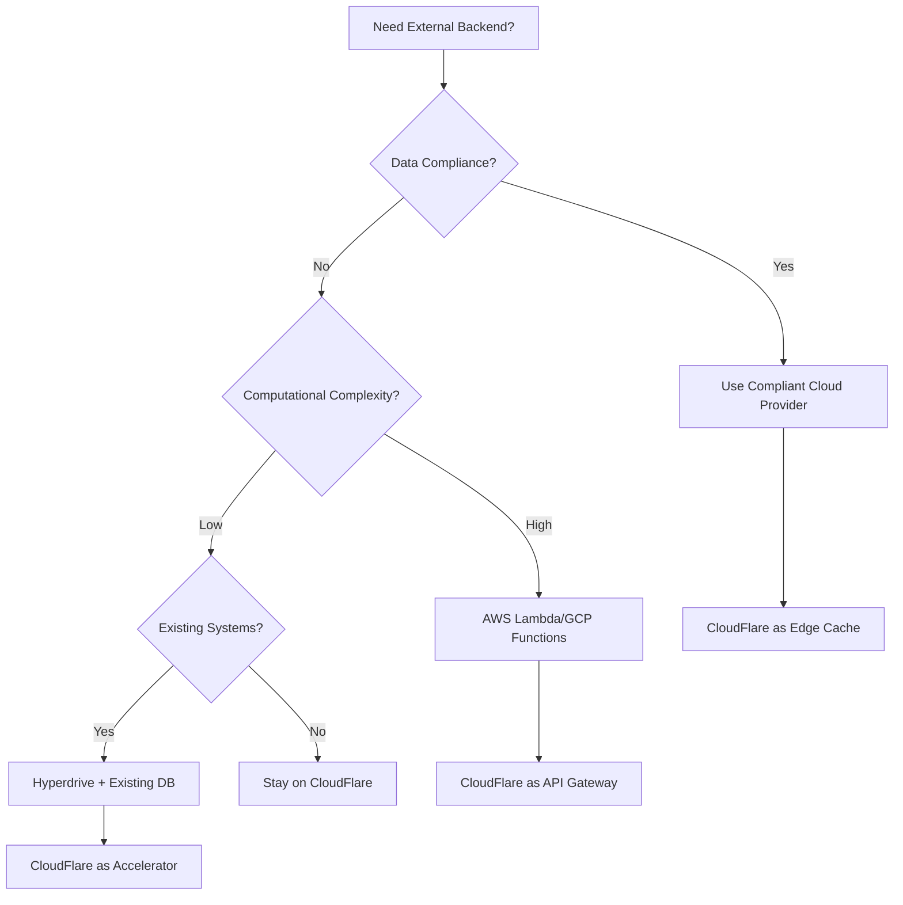

# CloudFlare Tech Stack Integration Guide

## 🌐 CloudFlare-First Architecture for Astro Applications

This guide shows how to leverage CloudFlare's edge computing platform with your multi-framework Astro application for maximum performance and cost efficiency.

## 📊 CloudFlare Services Decision Matrix

### KV (Key-Value Store) - "The Speed Cache"

**Best for:** High-read, low-write data that needs global distribution

| Use Case | Implementation | Example |
|----------|---------------|---------|
| **Configuration data** | Store feature flags, site settings | Theme preferences, API endpoints |
| **Session storage** | Cache user sessions, temporary data | Login tokens, shopping cart state |
| **Content caching** | Cache API responses, computed data | Product listings, user profiles |
| **A/B testing** | Store experiment configurations | Feature rollouts, UI variants |
| **Rate limiting** | Track API usage per user/IP | Request counters, quotas |

```typescript
// Example: Caching expensive API calls in Server Islands
export async function GET({ request }: APIRoute) {
  const cacheKey = `products:${categoryId}`;
  
  // Try KV first
  let products = await env.PRODUCTS_KV.get(cacheKey, "json");
  
  if (!products) {
    // Expensive operation
    products = await fetchFromExternalAPI();
    // Cache for 1 hour
    await env.PRODUCTS_KV.put(cacheKey, JSON.stringify(products), {
      expirationTtl: 3600
    });
  }
  
  return new Response(JSON.stringify(products));
}
```

### D1 (SQL Database) - "The Relational Powerhouse"

**Best for:** Structured data requiring ACID transactions and complex queries

| Use Case | Implementation | Example |
|----------|---------------|---------|
| **User management** | User accounts, profiles, permissions | Authentication, user settings |
| **Content management** | Blog posts, pages, metadata | CMS functionality, SEO data |
| **E-commerce** | Products, orders, inventory | Shopping cart, order history |
| **Analytics** | Page views, user interactions | Custom analytics, reporting |
| **Relationships** | Many-to-many, foreign keys | User-product favorites, categories |

```typescript
// Example: User dashboard with complex queries
export async function GET({ locals }: APIRoute) {
  const { results } = await locals.DB.prepare(`
    SELECT 
      o.id, o.total, o.created_at,
      COUNT(oi.id) as item_count
    FROM orders o
    LEFT JOIN order_items oi ON o.id = oi.order_id
    WHERE o.user_id = ?
    GROUP BY o.id
    ORDER BY o.created_at DESC
    LIMIT 10
  `).bind(locals.user.id).all();
  
  return new Response(JSON.stringify(results));
}
```

### R2 (Object Storage) - "The Asset Manager"

**Best for:** Large files, static assets, and user-generated content

| Use Case | Implementation | Example |
|----------|---------------|---------|
| **Static assets** | Images, videos, documents | Product photos, user avatars |
| **File uploads** | User-generated content | Profile pictures, documents |
| **Backup storage** | Database exports, logs | Automated backups, archives |
| **CDN origin** | Serve optimized media | Image transformations, video streaming |
| **Large datasets** | CSV exports, reports | Analytics exports, bulk data |

```typescript
// Example: Image upload with automatic optimization
export async function POST({ request, locals }: APIRoute) {
  const formData = await request.formData();
  const file = formData.get('image') as File;
  
  // Store original in R2
  const originalKey = `uploads/original/${crypto.randomUUID()}-${file.name}`;
  await locals.R2.put(originalKey, file.stream());
  
  // Trigger image optimization (separate worker)
  await locals.IMAGE_QUEUE.send({
    originalKey,
    userId: locals.user.id,
    variants: ['thumbnail', 'medium', 'large']
  });
  
  return new Response(JSON.stringify({ 
    uploadId: originalKey,
    status: 'processing' 
  }));
}
```

### Durable Objects - "The Stateful Coordinator"

**Best for:** Real-time features requiring coordination and persistent state

| Use Case | Implementation | Example |
|----------|---------------|---------|
| **Real-time chat** | WebSocket connections, message history | Live support, team collaboration |
| **Live collaboration** | Document editing, shared whiteboards | Google Docs-like features |
| **Game sessions** | Multiplayer state, turn management | Browser games, interactive demos |
| **Live updates** | Real-time dashboards, live data | Stock prices, sports scores |
| **Coordination** | Distributed locks, leader election | Background job coordination |

```typescript
// Example: Real-time chat for customer support
export class ChatRoom {
  constructor(state: DurableObjectState) {
    this.state = state;
    this.sessions = new Map();
  }

  async handleWebSocket(request: Request) {
    const [client, server] = new WebSocketPair();
    const sessionId = crypto.randomUUID();
    
    this.sessions.set(sessionId, {
      websocket: server,
      userId: await this.authenticateUser(request),
      joinedAt: Date.now()
    });

    server.addEventListener('message', (event) => {
      const message = JSON.parse(event.data);
      this.broadcastMessage(message, sessionId);
    });

    return new Response(null, { status: 101, webSocket: client });
  }
}
```

### Hyperdrive - "The Database Accelerator"

**Best for:** Accelerating connections to external databases outside CloudFlare

| Use Case | Implementation | Example |
|----------|---------------|---------|
| **Legacy databases** | Existing PostgreSQL, MySQL on AWS/GCP | ERP systems, legacy applications |
| **Complex analytics** | Data warehouses, OLAP systems | BigQuery, Snowflake connections |
| **Third-party services** | SaaS databases you don't control | Stripe data, external APIs |
| **Hybrid architecture** | Gradual migration to CloudFlare | Incremental modernization |
| **Specialized databases** | Graph, time-series, document DBs | Neo4j, InfluxDB, MongoDB |

```typescript
// Example: Connecting to external PostgreSQL via Hyperdrive
export async function GET({ locals }: APIRoute) {
  // Hyperdrive accelerates this connection
  const client = postgres(locals.HYPERDRIVE_URL);
  
  const analytics = await client`
    SELECT 
      DATE_TRUNC('day', created_at) as date,
      COUNT(*) as orders,
      SUM(total) as revenue
    FROM legacy_orders 
    WHERE created_at >= NOW() - INTERVAL '30 days'
    GROUP BY DATE_TRUNC('day', created_at)
    ORDER BY date
  `;
  
  return new Response(JSON.stringify(analytics));
}
```

## 🏗️ External Backends - When to Go Outside CloudFlare

### AWS/GCP Integration Points

| Scenario | CloudFlare Role | External Role | Example |
|----------|----------------|---------------|---------|
| **AI/ML workloads** | Edge caching, API gateway | GPU instances, model inference | Image recognition, LLMs |
| **Heavy computation** | Request routing, result caching | Batch processing, data analysis | Report generation, ETL |
| **Specialized services** | Edge optimization | Domain-specific tools | Payment processing, email |
| **Legacy integration** | Modern frontend, caching | Existing enterprise systems | SAP, Oracle, mainframes |
| **Compliance needs** | Global delivery | Regulated data processing | HIPAA, SOX requirements |

### External Backend Decision Tree



## 🎯 Practical Architecture Patterns

### Pattern 1: E-commerce Platform
```typescript
// Product catalog (high-read, low-write)
KV: Product cache, pricing, inventory status
D1: Product metadata, categories, reviews
R2: Product images, videos, documents
Durable Objects: Real-time inventory updates
External: Payment processing (Stripe), fraud detection
```

### Pattern 2: SaaS Dashboard
```typescript
// User analytics and management
KV: Session data, feature flags, user preferences
D1: User accounts, subscription data, usage logs
R2: User uploads, export files, backups
Durable Objects: Real-time collaboration, live updates
Hyperdrive: Legacy CRM integration, external analytics
```

### Pattern 3: Content Platform
```typescript
// Blog/CMS with user interaction
KV: Page cache, site configuration, CDN headers
D1: Posts, comments, user management
R2: Media files, document uploads, static assets
Durable Objects: Live comments, real-time engagement
External: Email service (SendGrid), search (Algolia)
```

## 🚀 Integration with Astro Architecture

### Server Islands + CloudFlare Services
```astro
---
// Server Island that uses multiple CloudFlare services
export async function load() {
  // Check KV cache first
  const cached = await KV.get(`user-dashboard:${userId}`);
  if (cached) return JSON.parse(cached);

  // Fetch from D1 if not cached
  const userData = await DB.prepare(
    "SELECT * FROM users WHERE id = ?"
  ).bind(userId).first();

  // Cache for 5 minutes
  await KV.put(`user-dashboard:${userId}`, 
    JSON.stringify(userData), { expirationTtl: 300 });

  return userData;
}
---

<UserDashboard server:defer {userData} />
```

### SPA + Durable Objects
```typescript
// SPA section that uses WebSocket for real-time features
// /spa/chat/[...all].astro
export default function ChatApp() {
  const [ws, setWs] = createSignal<WebSocket>();
  
  onMount(() => {
    // Connect to Durable Object
    const websocket = new WebSocket('/api/chat-room/general');
    setWs(websocket);
  });

  return <ChatInterface websocket={ws()} />;
}
```

## 💰 Cost Optimization Strategy

### Free Tier Maximization
- **KV**: 100,000 reads/day, 1,000 writes/day
- **D1**: 5 million rows read, 100,000 rows written/day
- **R2**: 10GB storage, 1 million requests/month
- **Durable Objects**: 400,000 requests/month
- **Functions**: 100,000 requests/day

### Caching Strategy for Cost Control
```typescript
// Multi-tier caching to minimize paid operations
async function getExpensiveData(key: string) {
  // Tier 1: Browser cache (free)
  // Tier 2: CloudFlare edge cache (free)
  // Tier 3: KV cache (minimal cost)
  let data = await KV.get(key);
  
  if (!data) {
    // Tier 4: D1 database (paid operation)
    data = await DB.prepare("SELECT * FROM expensive_view WHERE id = ?")
      .bind(key).first();
    
    // Cache for 1 hour to minimize future D1 calls
    await KV.put(key, JSON.stringify(data), { expirationTtl: 3600 });
  }
  
  return data;
}
```

## 🔄 Data Flow Patterns

### Write-Heavy Pattern
```
Client → D1 (immediate write) → KV (async cache invalidation) → Edge Cache (purge)
```

### Read-Heavy Pattern
```
Client → Edge Cache → KV Cache → D1 → External API (fallback chain)
```

### Real-time Pattern
```
Client ←→ Durable Object ←→ D1 (persistence) → KV (state broadcast)
```

## 🛠️ Development Workflow

### Local Development
```bash
# CloudFlare local development with all services
npx wrangler dev --local
npx wrangler d1 migrations apply --local
npx wrangler kv:namespace create "CACHE" --preview
```

### Testing Strategy
```typescript
// Test CloudFlare services with Miniflare
import { Miniflare } from 'miniflare';

const mf = new Miniflare({
  kvNamespaces: ['CACHE'],
  d1Databases: ['DB'],
  durableObjects: { ChatRoom: 'ChatRoom' }
});

// Test your functions locally
```

### Deployment Pipeline
```yaml
# CloudFlare Pages with services binding
name: Deploy
on: [push]
jobs:
  deploy:
    steps:
      - run: npx wrangler d1 migrations apply
      - run: npx astro build
      - run: npx wrangler pages deploy dist/
```

## 🎉 The CloudFlare Advantage

Your Astro application will be:
- **Globally fast**: Edge computing everywhere
- **Cost effective**: Generous free tiers, pay-per-use
- **Fully integrated**: All services work together seamlessly
- **Developer friendly**: Excellent tooling and local development
- **Infinitely scalable**: From prototype to enterprise

This architecture lets you build everything from simple blogs to complex SaaS platforms entirely on CloudFlare's edge network!